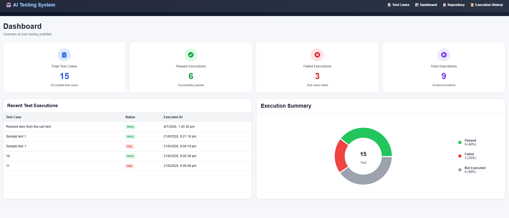
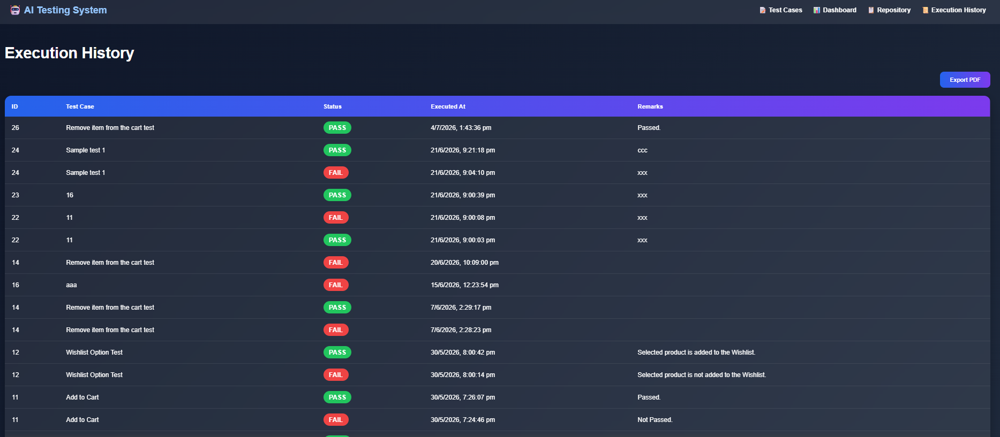
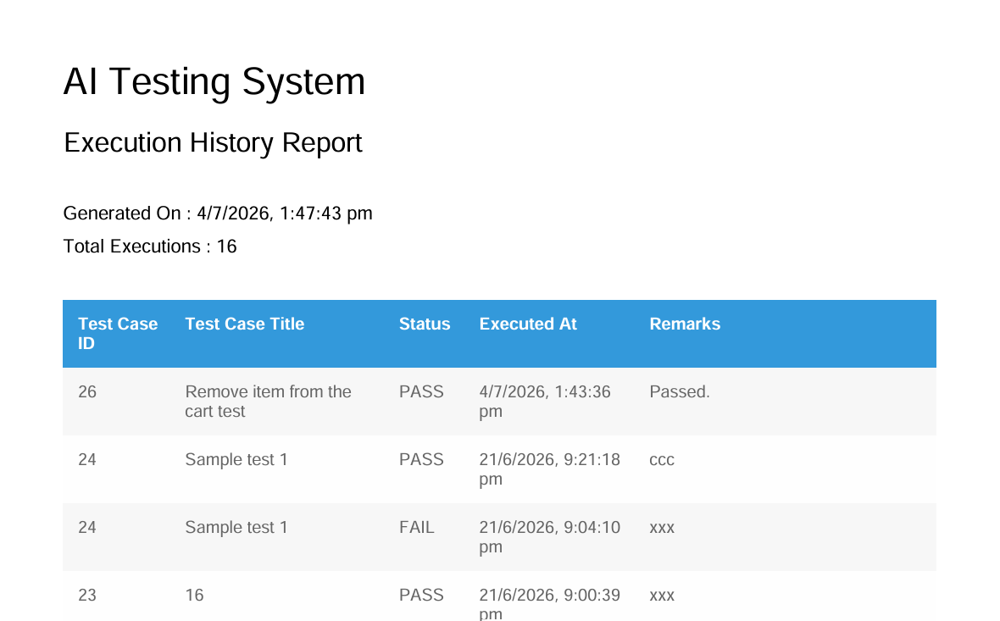
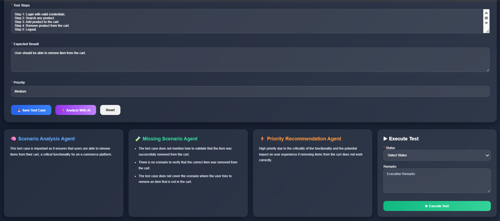

# 🤖 Agentic AI Testing System

An AI-assisted software testing platform developed as part of the MCA Minor Project at Amrita Online.

The system allows testers to create manual test cases, receive AI-powered analysis and recommendations, execute test cases, maintain execution history, visualize testing statistics through a dashboard, and export execution reports as PDF.

---

## 📌 Project Overview

Software testing is an essential phase of software development. Writing complete and effective test cases manually is time-consuming and error-prone.

This project uses AI to assist testers by analyzing test cases and providing:

- Scenario analysis
- Missing scenario detection
- Priority recommendations

The system also stores execution results and provides dashboard analytics and execution history.

---

## 🚀 Features

### ✅ Test Case Repository

- Create new test cases
- Update existing test cases
- Delete test cases
- View all test cases

---

### 🤖 AI Analysis

AI analyzes the test case and provides:

- Scenario Analysis
- Missing Scenarios
- Priority Recommendation

---

### ▶ Test Execution

Users can execute a test case by selecting:

- PASS
- FAIL

and entering remarks.

Execution details are stored in the database.

---

### 📊 Dashboard

Displays:

- Total Test Cases
- Total Executions
- Passed Executions
- Failed Executions
- Execution Summary Chart
- Recent Execution History

---

### 📜 Execution History

Displays complete execution history including:

- Test Case ID
- Test Case Title
- Status
- Execution Time
- Remarks

---

### 📄 PDF Export

Users can export the complete execution history as a professional PDF report.

---

## 🛠 Technologies Used

### Frontend

- React.js
- HTML
- CSS
- JavaScript

### Backend

- Spring Boot
- Java
- Spring MVC
- Spring Data JPA

### Database

- MySQL

### AI Module

- Python
- OpenAI API

### Libraries

- jsPDF
- jspdf-autotable
- Axios / Fetch API

---

## 🏗 System Architecture

```
React Frontend
       │
 REST API (HTTP)
       │
Spring Boot Backend
       │
 ┌──────────────┐
 │  AI Module   │
 └──────────────┘
       │
    MySQL
```

---

## 🗄 Database Tables

### TestCase

| Field | Description |
|-------|-------------|
| id | Test Case ID |
| title | Test Case Title |
| description | Test Description |
| steps | Test Steps |
| expectedResult | Expected Result |
| priority | Priority |

---

### TestResult

| Field | Description |
|-------|-------------|
| id | Execution ID |
| testCaseId | Linked Test Case |
| status | PASS / FAIL |
| remarks | Execution Remarks |
| executionTime | Execution Timestamp |

---

## 📷 Screenshots

- Home Page
- AI Analysis
- Dashboard
- Repository
- Execution History
- PDF Export

---

## ⚙ Installation

### Clone Repository

```bash
git clone https://github.com/swetham-10/agentic-ai-testing-system.git
```

---

### Backend

```bash
cd aitesting
```

Run Spring Boot application.

---

### Frontend

```bash
cd frontend
npm install
npm start
```

---

### Database

Create a MySQL database and update the database credentials in:

```
application.properties
```

---

## 📊 Project Modules

- Test Case Management
- AI Analysis
- Test Execution
- Dashboard
- Execution History
- PDF Export

---

## 🔮 Future Enhancements

- Automatic AI-based test execution
- Integration with CI/CD pipelines
- Blockchain-based audit trail for test execution history
- Role-based authentication and authorization
- Support for multiple AI models

---

## 👩‍💻 Developed By

**Swetha M**

Master of Computer Applications (MCA)

Amrita Online

---

## 📚 Academic Project

This project was developed as a Minor Project in partial fulfillment of the requirements for the Master of Computer Applications (MCA) degree at Amrita Vishwa Vidyapeetham.

## 📸 Project Screenshots

### Home Page


---

### Dashboard



---

### Execution History



---

### PDF Export



### AI Analysis

